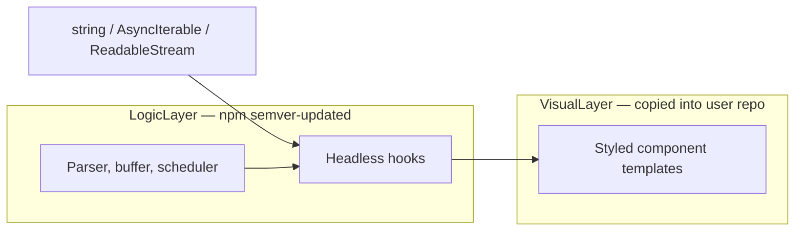

# agentle-ui Product Strategy Document

**Version:** 1.0  
**License:** MIT (pure open source)  
**Tagline:** A gentle UI for chaotic AI streams.

---

## 1. Executive Summary

### The Problem

Modern AI interfaces are jarring. When LLMs stream tokens to a screen, they cause violent layout shifts, broken markdown tables, blinking cursors, and confusing loading states. Standard UI libraries (Material, Bootstrap, Radix) were not built for unpredictable, real-time streaming data. Developers building AI agents, chatbots, and generative tools spend disproportionate time writing custom regex to fix broken markdown, hand-rolling loading spinners, and patching layout shift bugs — work that has nothing to do with their product's core value.

### The Solution

**agentle-ui** is a library of visual primitives designed specifically for AI-native applications. It acts as the bridge between raw, chaotic AI data and a polished user experience. We do not handle backend AI logic, model routing, or chat state. We exclusively handle making the visual output feel like a high-end, premium SaaS product.

### The Wedge

The 2026 AI UI landscape is crowded with chat frameworks (assistant-ui, Vercel AI Elements, CopilotKit). They solve "build a chat app." **agentle-ui solves "make any AI output feel calm."** We are the polish layer, not another chat framework. This complementary positioning turns incumbents into distribution channels instead of competitors.

### The Bet

Our moat is hard logic — incremental markdown completeness parsing, stream buffering, paint scheduling — shipped via semver on npm. Our pixels are premium templates copied into the user's repo via CLI, giving them full ownership without maintenance burden on us. "Gentle" is not marketing fluff; it is a technical claim backed by zero-CLS guarantees, buffered rendering, and `prefers-reduced-motion` support.

### Architecture in One Sentence

`npm i agentle-ui` for headless hooks; `npx agentle-ui add markdown-stabilizer` for styled components — data-agnostic, zero AI-vendor dependencies, React-only peers.

---

## 2. Market & Competitive Analysis

### Landscape Overview (2026)

| Library | Philosophy | Streaming | Markdown | Agent Actions | Vendor Lock-in |
|---------|-----------|-----------|----------|---------------|----------------|
| **assistant-ui** | Headless chat primitives (Radix-style) | First-class | Built-in | Generative UI, tool calls | Tight AI SDK integration |
| **Vercel AI Elements** | Pre-styled shadcn components on AI SDK | First-class | Built-in | Tool UI blocks | Vercel ecosystem |
| **CopilotKit** | Full agentic app framework | First-class | Built-in | Deep app-state integration | Framework-level |
| **llm-ui** | Markdown block streaming | Block-level | Core focus | None | Minimal |
| **Deep Chat** | Single embeddable widget | Yes | Basic | Limited | Framework-agnostic |
| **agentle-ui** | Streaming presentation polish | Core focus | Stabilized rendering | Action Card primitive | **Zero** |

### Where the Gap Is

Every incumbent treats streaming presentation quality as a feature checkbox — "we render markdown." None treat it as a **first-class product discipline** with measurable guarantees:

- **Layout stability during stream:** No library publishes CLS budgets or buffers incomplete markdown structures before paint.
- **Thought/process visualization:** Loading states remain spinners or generic "thinking..." text. Agentic transparency (what the AI is doing behind the scenes) is an afterthought.
- **Tool action transparency:** Tool calls are rendered as raw JSON or collapsible code blocks, not as designed UI primitives.
- **Prompt input intelligence:** Composers exist, but none are purpose-built for the multi-modal, slash-command, attachment-heavy interaction patterns AI apps demand.

### Competitive Positioning Map

```
                    Full Chat Framework
                           │
              CopilotKit   │   assistant-ui
                           │   AI Elements
                           │
  Generic ◄────────────────┼────────────────► AI-Specific
  UI                       │
                           │
                           │   agentle-ui ◄── our wedge
                           │
                    Presentation Primitives
```

We occupy the bottom-right quadrant: AI-specific, presentation-only. We do not compete with assistant-ui on chat state management. We compete on making their output — or anyone's output — feel premium.

### Why Not Build Another Chat Framework?

1. **assistant-ui has ~8k stars and production deployments.** Competing head-on is a multi-year, multi-engineer bet with no differentiation.
2. **Our target audience already chose a backend.** They use AI SDK, LangGraph, raw SSE, or a custom WebSocket. They need polish, not another runtime.
3. **Maintenance surface.** Chat frameworks must track every AI SDK breaking change. We accept `string | AsyncIterable<string> | ReadableStream` and are done.

---

## 3. Positioning & Messaging

### Positioning Statement

For frontend developers and indie hackers building AI agents, chatbots, and generative tools, **agentle-ui** is the presentation layer that transforms chaotic AI streams into calm, premium UI — unlike chat frameworks that bundle state management and vendor dependencies, agentle-ui is data-agnostic, ships hard logic via npm, and gives you styled components you fully own.

### Tagline System

| Context | Copy |
|---------|------|
| **Primary** | A gentle UI for chaotic AI streams. |
| **Technical** | Zero layout shift. Zero vendor lock-in. Zero excuses. |
| **Developer** | `npm i agentle-ui` — hooks for the hard parts, templates for the pixels. |
| **Contrast** | They give you a chat. We make it feel like Linear, not a terminal. |

### "Gentle" as a Technical Claim

"Gentle" is not aesthetic marketing. It is backed by measurable engineering guarantees:

| Claim | Mechanism |
|-------|-----------|
| **Zero layout shift (CLS ≈ 0)** | Markdown Stabilizer buffers incomplete structures (tables, code fences, lists) and only paints when visually complete |
| **No jank during stream** | Paint scheduler decouples consumer re-renders from DOM updates; tokens batch into frame-budget-aligned paints |
| **Calm motion** | Opinionated easing curves, minimum frame budgets, no blinking cursors or pulsing spinners in default templates |
| **Accessible by default** | `prefers-reduced-motion` respected; ARIA live regions for streaming content; keyboard-navigable Action Cards |

### Elevator Pitches

**Indie hacker (30 seconds):**  
"You know how every AI app you build has broken markdown tables mid-stream and layout jumping everywhere? agentle-ui fixes that. `npm i agentle-ui` for the streaming logic, `npx agentle-ui add markdown-stabilizer` for a styled component you own. Works with any backend — raw fetch, AI SDK, whatever. Zero vendor lock-in."

**Startup FE lead (60 seconds):**  
"We're not another chat framework. assistant-ui handles your thread state; agentle-ui handles presentation quality. Our Markdown Stabilizer guarantees zero CLS during token streaming — we buffer incomplete markdown structures and only render when they're visually complete. Our hooks accept plain strings or streams; no adapter packages, no AI SDK peer dependency. Styled templates copy into your repo so your design team owns the pixels. Logic ships via npm semver so parser fixes reach everyone."

**OSS contributor (30 seconds):**  
"The moat is the incremental markdown completeness parser and paint scheduler — that's the npm package. Templates are copy-paste React files consuming those hooks. Parser bugs get semver fixes; styling is the user's file. Monorepo, pnpm workspaces, MIT license."

---

## 4. Product Architecture & The Four Pillars

### Two-Layer Architecture



**Logic layer (`agentle-ui` on npm):** Headless hooks and engines. Semver-updated. Zero AI-vendor dependencies. React/ReactDOM as sole peers.

**Visual layer (CLI copy-paste):** Fully styled premium components copied as readable source files into the user's repo. Users own the pixels. No override APIs to maintain.

### Data-Agnostic Contract

Every hook accepts one of:

```typescript
type StreamInput = string | AsyncIterable<string> | ReadableStream<Uint8Array>;
```

The logic layer normalizes all three into an internal token buffer. The paint scheduler reads from the buffer and commits to the DOM on frame boundaries — decoupling consumer re-renders from visual updates. This is a headline engineering claim: even if the parent re-renders on every token, the UI does not jank.

---

### Pillar 1: Markdown Stabilizer

**Problem:** Incomplete markdown structures (unclosed code fences, partial table rows, broken list items) render mid-stream, causing layout collapse and reflow when the closing syntax arrives.

**UX Behavior:**
- Incoming tokens accumulate in a buffer.
- An incremental completeness parser classifies each markdown block (paragraph, heading, code fence, table, list, blockquote) as `incomplete | complete | stable`.
- Only `complete` or `stable` blocks are painted to the DOM.
- Incomplete blocks show a subtle placeholder skeleton (same dimensions as expected output) — no content flash, no layout shift.
- Inline code and partial paragraphs stream character-by-character within a stable block container (fixed line height, no reflow).
- On stream end, all remaining incomplete blocks flush as-is (graceful degradation, not infinite skeleton).

**Headless Hook API:**

```typescript
function useStabilizedMarkdown(input: StreamInput, options?: {
  debounceMs?: number;        // frame budget, default 16
  flushOnComplete?: boolean;  // flush incomplete on stream end, default true
  onBlockRendered?: (block: MarkdownBlock) => void;
}): {
  renderedBlocks: MarkdownBlock[];  // blocks safe to paint
  pendingBlocks: MarkdownBlock[];   // buffered, not yet painted
  isStreaming: boolean;
  isComplete: boolean;
}
```

**Template Sketch (`components/agentle/markdown-stabilizer.tsx`):**

```tsx
import { useStabilizedMarkdown } from "agentle-ui";

export function MarkdownStabilizer({ content }: { content: StreamInput }) {
  const { renderedBlocks, pendingBlocks, isStreaming } = useStabilizedMarkdown(content);

  return (
    <div className="agentle-markdown" data-streaming={isStreaming}>
      {renderedBlocks.map((block) => (
        <BlockRenderer key={block.id} block={block} />
      ))}
      {pendingBlocks.map((block) => (
        <BlockSkeleton key={block.id} type={block.type} />
      ))}
    </div>
  );
}
```

**Key Technical Challenges:**
- Incremental markdown completeness detection without full re-parse on every token (trie-based fence tracking, row/column counting for tables).
- Skeleton dimension estimation for incomplete blocks (heuristic based on partial content + block type defaults).
- Code block syntax highlighting deferred until fence closes (avoids re-highlighting on every token).

---

### Pillar 2: Thought Visualizer

**Problem:** Static spinners and "thinking..." text tell users nothing. Agentic AI performs multi-step work (searching, reading files, calling APIs) that users want visibility into.

**UX Behavior:**
- Accepts a stream of thought steps — each step has a label and optional detail.
- Steps appear sequentially with a calm fade-in (no slide/bounce).
- Active step shows a subtle pulse indicator (respects `prefers-reduced-motion`: static dot instead).
- Completed steps collapse to a single line with a checkmark; expandable on click.
- On stream completion, all steps collapse into a summary line ("Searched web, read 3 files, called API").

**Headless Hook API:**

```typescript
type ThoughtStep = {
  id: string;
  label: string;           // "Searching the web..."
  detail?: string;         // optional expanded text
  status: "active" | "complete" | "error";
};

function useThoughtStream(input: StreamInput | ThoughtStep[], options?: {
  collapseOnComplete?: boolean;
  reducedMotion?: boolean;  // auto-detected from media query if omitted
}): {
  steps: ThoughtStep[];
  activeStep: ThoughtStep | null;
  isComplete: boolean;
  summary: string | null;   // collapsed summary text
}
```

**Template Sketch (`components/agentle/thought-visualizer.tsx`):**

```tsx
import { useThoughtStream } from "agentle-ui";

export function ThoughtVisualizer({ thoughts }: { thoughts: StreamInput | ThoughtStep[] }) {
  const { steps, activeStep, isComplete, summary } = useThoughtStream(thoughts);

  if (isComplete && summary) {
    return <CollapsedSummary text={summary} steps={steps} />;
  }

  return (
    <div className="agentle-thoughts" role="status" aria-live="polite">
      {steps.map((step) => (
        <ThoughtStepRow key={step.id} step={step} isActive={step.id === activeStep?.id} />
      ))}
    </div>
  );
}
```

**Key Technical Challenges:**
- Parsing thought steps from unstructured stream text (convention: JSON lines or markdown list items) vs. structured input.
- Smooth step transitions without layout shift (fixed-height step rows during active phase).
- Summary generation from completed steps (template-based, not LLM-generated).

---

### Pillar 3: Action Card

**Problem:** When an AI calls an external tool (search, file read, API call), the raw output is typically JSON in a code block. Users cannot understand what the agent did or whether to trust the result.

**UX Behavior:**
- Renders a collapsible card for each agent action.
- Header shows: action name, status icon (running / success / error), duration.
- Collapsed by default after completion; expanded while running.
- Body shows formatted input parameters and output (syntax-highlighted JSON, or human-readable summary).
- Error state: red accent, error message, retry affordance (callback prop, not built-in retry logic).
- Multiple concurrent actions stack vertically with independent expand/collapse.

**Headless Hook API:**

```typescript
type AgentAction = {
  id: string;
  name: string;              // "web_search", "read_file"
  status: "running" | "success" | "error";
  input?: Record<string, unknown>;
  output?: unknown;
  error?: string;
  startedAt?: number;
  completedAt?: number;
};

function useActionState(action: AgentAction | AgentAction[]): {
  actions: AgentAction[];
  runningCount: number;
  toggleExpanded: (id: string) => void;
  isExpanded: (id: string) => boolean;
  formatDuration: (action: AgentAction) => string;
}
```

**Template Sketch (`components/agentle/action-card.tsx`):**

```tsx
import { useActionState } from "agentle-ui";

export function ActionCard({ action }: { action: AgentAction }) {
  const { toggleExpanded, isExpanded, formatDuration } = useActionState(action);
  const expanded = isExpanded(action.id);

  return (
    <div className="agentle-action-card" data-status={action.status}>
      <button
        className="agentle-action-card__header"
        onClick={() => toggleExpanded(action.id)}
        aria-expanded={expanded}
      >
        <StatusIcon status={action.status} />
        <span className="agentle-action-card__name">{action.name}</span>
        {action.completedAt && (
          <span className="agentle-action-card__duration">{formatDuration(action)}</span>
        )}
      </button>
      {expanded && (
        <div className="agentle-action-card__body">
          {action.input && <JsonBlock label="Input" data={action.input} />}
          {action.output && <JsonBlock label="Output" data={action.output} />}
          {action.error && <ErrorBlock message={action.error} />}
        </div>
      )}
    </div>
  );
}
```

**Key Technical Challenges:**
- Duration tracking without requiring the consumer to manage timestamps (hook auto-records on status transitions).
- Large JSON output truncation with "show more" (performance on multi-KB tool outputs).
- Concurrent action stacking without layout shift as new cards appear.

---

### Pillar 4: Prompt Surface

**Problem:** Standard textareas do not support the interaction patterns AI apps need: multi-line input with auto-grow, file attachments, slash commands, and submit-on-Enter-with-Shift-Enter-for-newline.

**UX Behavior:**
- Auto-growing textarea (no manual resize handle).
- Drag-and-drop and click-to-attach file zones.
- Slash command detection: typing `/` opens a filtered command palette.
- Enter submits; Shift+Enter inserts newline.
- Disabled state during AI response streaming.
- Attachment previews with remove affordance.
- Character/token count (optional, configurable).

**Headless Hook API:**

```typescript
type PromptAttachment = {
  id: string;
  name: string;
  type: string;
  size: number;
  preview?: string;  // data URL for images
};

type SlashCommand = {
  name: string;
  description: string;
  action: () => void;
};

function usePromptSurface(options?: {
  commands?: SlashCommand[];
  maxAttachments?: number;
  maxFileSize?: number;
  onSubmit?: (text: string, attachments: PromptAttachment[]) => void;
  disabled?: boolean;
}): {
  text: string;
  setText: (text: string) => void;
  attachments: PromptAttachment[];
  addAttachment: (file: File) => void;
  removeAttachment: (id: string) => void;
  activeCommand: SlashCommand | null;
  filteredCommands: SlashCommand[];
  handleKeyDown: (e: React.KeyboardEvent) => void;
  submit: () => void;
  isSubmitting: boolean;
}
```

**Template Sketch (`components/agentle/prompt-surface.tsx`):**

```tsx
import { usePromptSurface } from "agentle-ui";

export function PromptSurface({ onSubmit, commands, disabled }: PromptSurfaceProps) {
  const {
    text, setText, attachments, removeAttachment,
    activeCommand, filteredCommands, handleKeyDown, submit,
  } = usePromptSurface({ onSubmit, commands, disabled });

  return (
    <div className="agentle-prompt">
      {attachments.length > 0 && (
        <AttachmentBar attachments={attachments} onRemove={removeAttachment} />
      )}
      <div className="agentle-prompt__input-row">
        <textarea
          className="agentle-prompt__textarea"
          value={text}
          onChange={(e) => setText(e.target.value)}
          onKeyDown={handleKeyDown}
          placeholder="Ask anything..."
          disabled={disabled}
          rows={1}
        />
        <SubmitButton onClick={submit} disabled={disabled || !text.trim()} />
      </div>
      {activeCommand && (
        <CommandPalette commands={filteredCommands} />
      )}
    </div>
  );
}
```

**Key Technical Challenges:**
- Auto-grow textarea without layout shift (hidden mirror element for height calculation).
- Slash command parsing without interfering with normal text input (only trigger at line start or after whitespace).
- File drag-and-drop zone overlay without blocking textarea interaction.
- Accessibility: textarea + command palette keyboard navigation, screen reader announcements for attachments.

---

## 5. Packaging & Distribution Architecture

### Monorepo Structure

```
agentle-ui/
├── packages/
│   ├── agentle-ui/              # npm package: hooks, engines, CLI bin
│   │   ├── src/
│   │   │   ├── hooks/           # useStabilizedMarkdown, useThoughtStream, etc.
│   │   │   ├── engines/         # markdown parser, buffer, scheduler
│   │   │   └── index.ts         # public exports
│   │   ├── bin/
│   │   │   └── agentle-ui.js    # CLI entry point
│   │   └── package.json
│   └── registry/                # component templates (NOT published to npm)
│       ├── markdown-stabilizer/
│       ├── thought-visualizer/
│       ├── action-card/
│       └── prompt-surface/
├── apps/
│   └── www/                     # docs site + demo + registry JSON host
├── pnpm-workspace.yaml
└── package.json
```

**Tooling:** pnpm workspaces from day one. Add Turborepo when build times hurt. Add Changesets when publishing regularly. Do not start with Nx or remote caching.

### npm Package (`agentle-ui`)

| Property | Value |
|----------|-------|
| **Exports** | Tree-shakeable ESM (`"type": "module"`) |
| **Peer dependencies** | `react >= 18`, `react-dom >= 18` |
| **AI-vendor dependencies** | **Zero** |
| **Bundle budget** | < 15 KB gzipped for core hooks (parser + scheduler) |
| **Public API** | Hooks + types only. No styled components in the npm package. |

```typescript
// Public exports from "agentle-ui"
export { useStabilizedMarkdown } from "./hooks/use-stabilized-markdown";
export { useThoughtStream } from "./hooks/use-thought-stream";
export { useActionState } from "./hooks/use-action-state";
export { usePromptSurface } from "./hooks/use-prompt-surface";
export type { StreamInput, MarkdownBlock, ThoughtStep, AgentAction, PromptAttachment, SlashCommand };
```

### CLI Design

| Command | Behavior |
|---------|----------|
| `npx agentle-ui init` | Detect project (Next.js, Vite, etc.), create `components/agentle/` directory, write `agentle-ui.json` config |
| `npx agentle-ui add markdown-stabilizer` | Copy template + dependencies from registry into user's repo |
| `npx agentle-ui add thought-visualizer` | Same pattern |
| `npx agentle-ui add action-card` | Same pattern |
| `npx agentle-ui add prompt-surface` | Same pattern |
| `npx agentle-ui diff markdown-stabilizer` | (v1.0) Show diff between user's copied file and latest registry template |

**Registry hosting:** Static JSON + source files served from `apps/www` (same pattern as shadcn/ui). CLI fetches from `https://agentle-ui.dev/r/{component}.json` (or GitHub raw as fallback).

**Config file (`agentle-ui.json`):**

```json
{
  "$schema": "https://agentle-ui.dev/schema.json",
  "style": "default",
  "rsc": false,
  "tsx": true,
  "tailwind": {
    "config": "tailwind.config.ts",
    "css": "src/app/globals.css",
    "baseColor": "neutral"
  },
  "aliases": {
    "components": "@/components",
    "utils": "@/lib/utils"
  }
}
```

### How Updates Propagate

| Change type | Propagation | User action |
|-------------|-------------|-------------|
| Parser/scheduler bug fix | Automatic via `npm update agentle-ui` | Run npm update |
| Hook API change | Semver bump + changelog | Update npm dep, adjust copied template if needed |
| Visual template improvement | **Not automatic** | Run `npx agentle-ui diff` then manually merge, or re-add |
| New component | CLI add | Run `npx agentle-ui add <new-component>` |

This is the acknowledged trade-off of copy-paste distribution: logic fixes are seamless; visual improvements require user opt-in.

---

## 6. Scope Discipline

### Explicit Non-Goals

| Non-goal | Rationale |
|----------|-----------|
| **Chat state management** | assistant-ui, AI SDK, and others own thread/message state. We render what you give us. |
| **Backend / model routing** | We accept strings and streams. How you get them is your problem. |
| **Model provider integrations** | Zero adapters. Integration recipes in docs, not code. |
| **SDK adapters** | No `@agentle-ui/react-ai-sdk` package. Users pipe SDK output into our hooks. |
| **Sealed styling API** | No theme provider, no CSS-in-JS runtime, no override prop system. Users own the copied files. |
| **Full chat thread component** | v1 ships four primitives, not a monolithic `<Chat />`. Users compose their own layout. |
| **Framework bindings beyond React** | v1 is React-only. Vue/Svelte bindings are a future consideration, not v1 scope. |
| **Commercial features** | Pure MIT OSS. No open-core, no paid pro blocks, no cloud service. |

### Why These Boundaries Matter

Every non-goal we reject is a maintenance surface we do not staff. A solo/small-team OSS project dies from scope creep, not from missing features. Our target audience chose their backend; they need polish, not another runtime to learn.

---

## 7. Roadmap

### v0.1 — The Killer Demo (4–6 weeks)

**Ship:**
- `useStabilizedMarkdown` hook with incremental completeness parser
- Stream buffer + paint scheduler
- Markdown Stabilizer template (styled, copy-paste via CLI)
- `npx agentle-ui init` + `npx agentle-ui add markdown-stabilizer`
- Demo site: side-by-side "jank vs gentle" comparison with live streaming

**Success criteria:**
- Demo site live and shareable
- Zero CLS measured in Lighthouse during simulated token stream
- npm package published, < 15 KB gzipped
- README with 5-minute integration guide

### v0.5 — Four Pillars (8–10 weeks from v0.1)

**Ship:**
- `useThoughtStream`, `useActionState`, `usePromptSurface` hooks
- Thought Visualizer, Action Card, Prompt Surface templates
- CLI `add` for all four components
- Basic docs site with API reference and integration recipes

**Success criteria:**
- All four pillars documented with live examples
- Integration recipes for: raw SSE, Vercel AI SDK, assistant-ui (docs only, no adapter code)
- 100 npm weekly downloads

### v1.0 — Production Ready (12–16 weeks from v0.5)

**Ship:**
- CLI `diff` command for template re-sync
- Full a11y audit (axe-core CI, manual screen reader testing)
- `prefers-reduced-motion` support across all templates
- Bundle size CI gate (fail build if core exceeds budget)
- Changesets for automated semver publishing
- "Used by" showcase section on docs site

**Success criteria:**
- 500 npm weekly downloads
- 3+ external projects listed in "Used by"
- Zero open a11y violations
- Time-to-first-integration documented and verified under 5 minutes

### Post-v1.0 (Not Committed)

- CLI `migrate` command for template updates
- Additional templates (message bubble, thread list, toolbar)
- Vue/Svelte hook ports (community-driven or sponsored)
- Figma design kit matching default templates

---

## 8. Go-to-Market (Open Source)

### Launch Sequence

**Phase 1: Demo before docs (week 1–2 of v0.1)**

Build the "jank vs gentle" interactive demo site first. This is the hero asset — a split-screen showing the same AI stream rendered with raw markdown vs. Markdown Stabilizer. Side-by-side CLS metrics update in real time. This demo IS the marketing.

**Phase 2: Soft launch (week 3–4 of v0.1)**

- Publish npm package
- GitHub repo public with polished README (README is the landing page until docs site ships)
- Post to r/reactjs, r/webdev with demo link
- Tweet thread: problem → demo → `npm i agentle-ui`

**Phase 3: Hard launch (v0.5)**

- Show HN: "Show HN: agentle-ui – A gentle UI for chaotic AI streams"
- Dev.to / personal blog: "Why your AI app feels broken (and how to fix it)"
- Submit to JavaScript Weekly, React Status newsletter
- Integration recipe posts: "Using agentle-ui with Vercel AI SDK in 5 minutes"

**Phase 4: Community (v1.0+)**

- "Used by" showcase on docs site (submit via GitHub issue)
- Good first issue labels for contributors
- Monthly changelog posts
- Consider Discord or GitHub Discussions (not Slack — OSS community expects GitHub-native)

### Content Strategy

| Content type | Purpose | Channel |
|-------------|---------|---------|
| "Why your AI app feels broken" | Problem awareness | Blog, Dev.to, HN |
| "Jank vs Gentle" demo | Product proof | Docs site hero, social |
| Integration recipes | Adoption friction reduction | Docs, blog posts |
| CLS benchmarks | Technical credibility | Blog, README badge |
| Changelog | Retention, re-engagement | GitHub releases, social |

### README as Landing Page (v0.1)

The GitHub README must contain:
1. One-line tagline + demo GIF (side-by-side streaming)
2. Install commands (`npm i agentle-ui` + `npx agentle-ui add`)
3. 10-line usage example
4. Table of four pillars with one-line descriptions
5. "Why not assistant-ui?" FAQ section (complementary, not competitive)
6. Bundle size badge
7. License (MIT)

---

## 9. Success Metrics

### Primary Metrics

| Metric | Target (v0.5) | Target (v1.0) | Tool |
|--------|-----------------|----------------|------|
| npm weekly downloads | 100 | 500 | npm stats |
| CLI component installs | 50 | 250 | Telemetry in CLI (opt-out) |
| Demo site unique visitors | 1,000 | 5,000 | Plausible/Fathom |
| GitHub stars | 200 | 1,000 | GitHub |

### Quality Metrics

| Metric | Target | Tool |
|--------|--------|------|
| Core bundle size | < 15 KB gzipped | size-limit CI |
| CLS during stream | 0 | Lighthouse CI |
| a11y violations | 0 | axe-core CI |
| Time-to-first-integration | < 5 min | Manual verification, docs feedback |

### Vanity vs. Signal

- **Stars:** Vanity. Nice for credibility, not actionable.
- **npm downloads:** Signal. People installing means they're trying it.
- **CLI installs:** Strong signal. Copying a template means they're building with it.
- **"Used by" submissions:** Strongest signal. Production usage.

### Feedback Loops

- GitHub Issues: bug reports, feature requests
- GitHub Discussions: integration questions, showcase
- Docs site feedback widget (v0.5+)
- npm download trend monitoring (weekly review)

---

## Appendix A: Integration Recipes (Documentation-Only)

These are doc examples, not shipped adapter code.

### Raw SSE Stream

```tsx
const [content, setContent] = useState("");
useEffect(() => {
  const es = new EventSource("/api/stream");
  es.onmessage = (e) => setContent((prev) => prev + e.data);
  return () => es.close();
}, []);
return <MarkdownStabilizer content={content} />;
```

### Vercel AI SDK

```tsx
const { messages } = useChat();
const lastAssistant = messages.filter((m) => m.role === "assistant").at(-1);
return <MarkdownStabilizer content={lastAssistant?.content ?? ""} />;
```

### assistant-ui

```tsx
// Inside an assistant-ui Message primitive render function
<MessagePrimitive.Content>
  {({ text }) => <MarkdownStabilizer content={text} />}
</MessagePrimitive.Content>
```

### LangGraph Stream

```tsx
for await (const chunk of stream) {
  if (chunk.type === "text") appendContent(chunk.content);
}
return <MarkdownStabilizer content={content} />;
```

---

## Appendix B: Monorepo Tooling Decisions

| Decision | Choice | Rationale |
|----------|--------|-----------|
| Package manager | pnpm | Workspace support, disk efficiency |
| Build tool | tsup (packages), Next.js (docs) | Fast, zero-config ESM |
| Test runner | Vitest | Fast, ESM-native |
| Linting | ESLint + Prettier | Standard |
| Versioning | Changesets (v1.0+) | Automated semver for npm publishes |
| CI | GitHub Actions | Lint, test, size-limit, axe-core |
| Docs hosting | Vercel | Free for OSS, fast deploys |

---

## Appendix C: Design Tokens (Default Template Theme)

Templates use CSS custom properties for theming. Users edit these in their copied files.

```css
:root {
  --agentle-font: system-ui, -apple-system, sans-serif;
  --agentle-font-mono: ui-monospace, "Cascadia Code", monospace;
  --agentle-radius: 0.5rem;
  --agentle-spacing: 0.25rem;

  /* Calm palette */
  --agentle-bg: #fafafa;
  --agentle-bg-subtle: #f4f4f5;
  --agentle-text: #18181b;
  --agentle-text-muted: #71717a;
  --agentle-border: #e4e4e7;
  --agentle-accent: #6366f1;
  --agentle-success: #22c55e;
  --agentle-error: #ef4444;

  /* Motion */
  --agentle-ease: cubic-bezier(0.25, 0.1, 0.25, 1);
  --agentle-duration: 200ms;
  --agentle-duration-slow: 400ms;
}

@media (prefers-reduced-motion: reduce) {
  :root {
    --agentle-duration: 0ms;
    --agentle-duration-slow: 0ms;
  }
}
```

---

*End of document.*
